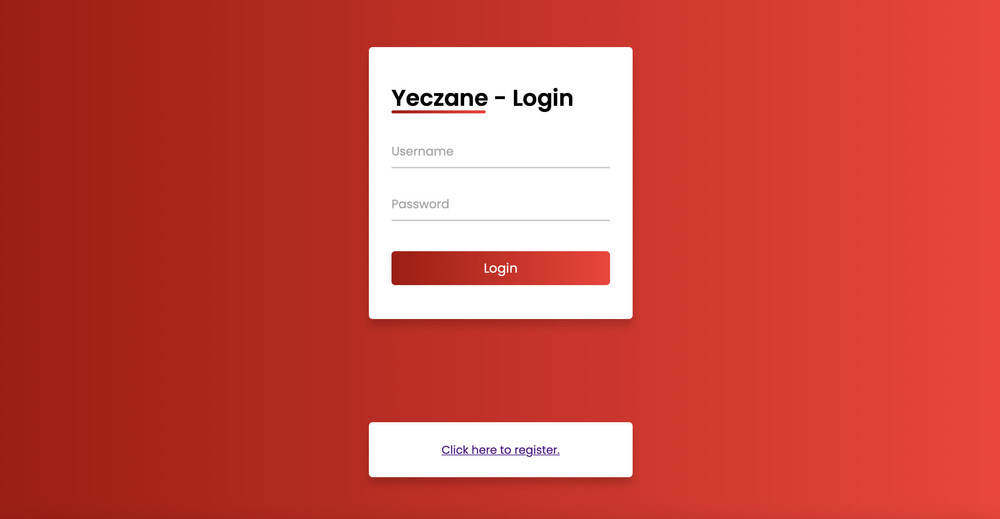
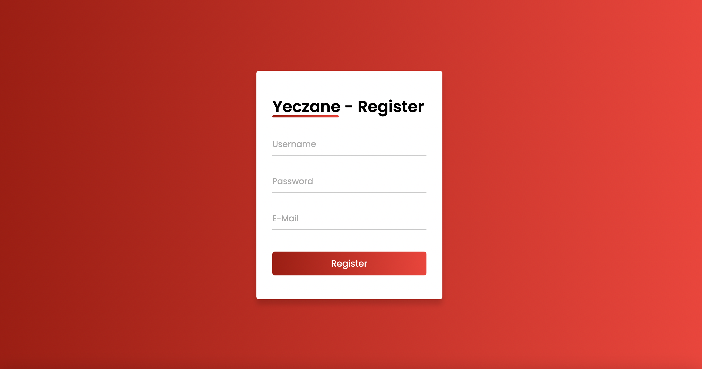
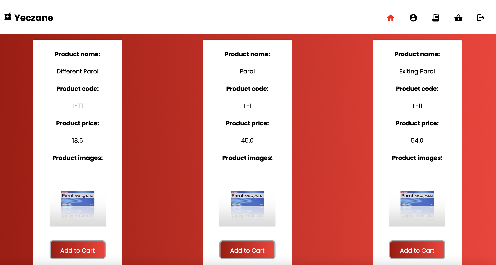
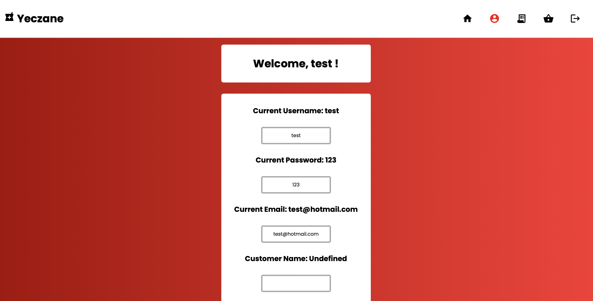
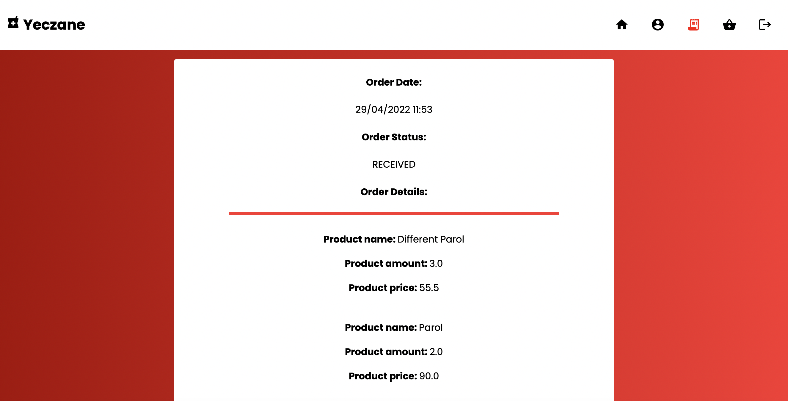
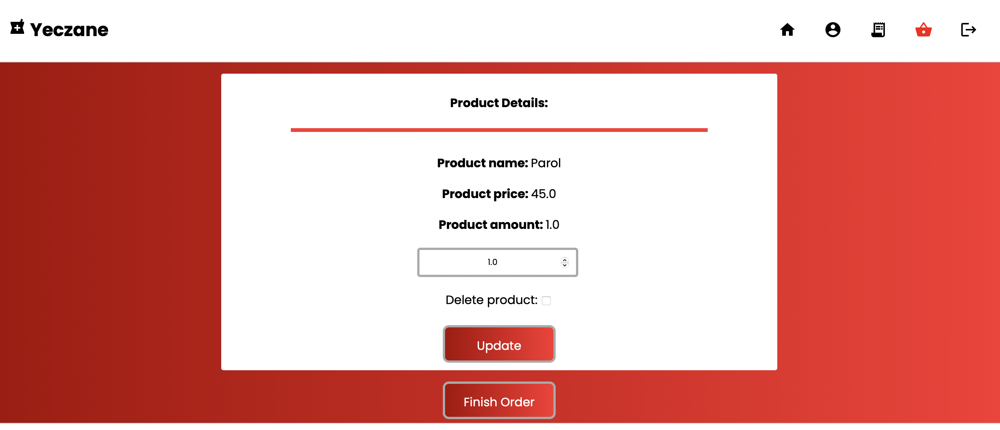
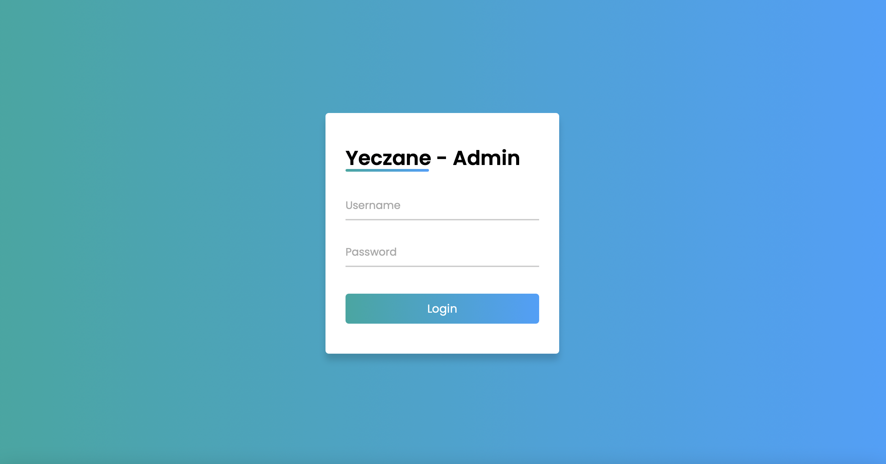
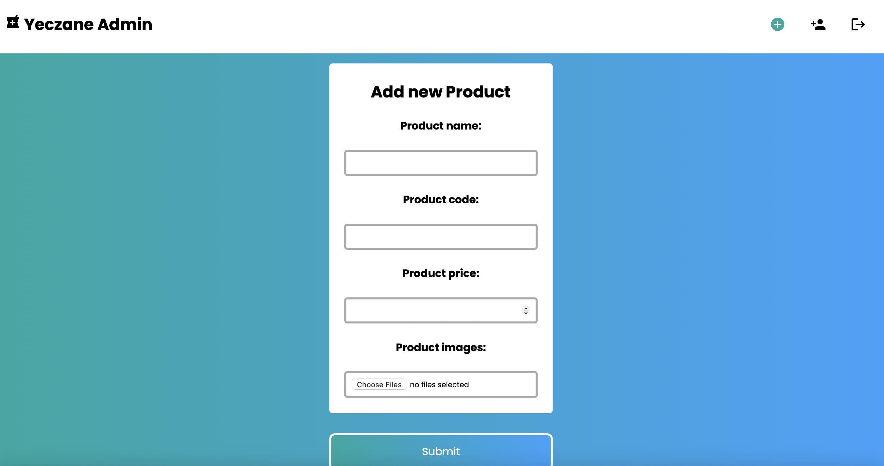
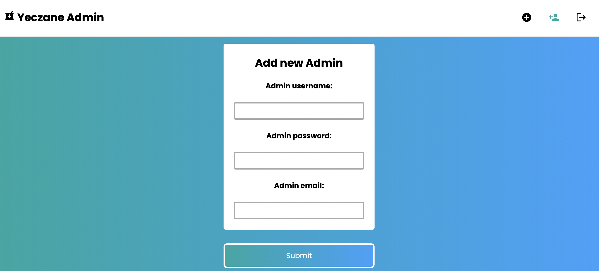

# Yeczane - Online Pharmacy Store
## _Made with Spring Framework by Denizhan Aras_

Yeczane is a website that allows users to buy medicine online. There is an admin panel available to create products or add new admin users. User can add products to basket, update their amount, delete products from basket and of course finish order.

- Made with Spring MVC.
- Spring Security used.
  - User & Admin Registration Systems
  - Two different authentication: one for users other for admins.
- Docker-compose used in order to prepare development environment.
  - App can easily be ready for development or test purposes locally.
  - Run `docker-compose up -d yeczanedatabase` in projects's root folder.
  - If there is no problem, you can run the program.
- Front-end development strategy is server-side rendering.
  - Thymeleaf were used in this project.
- Postgres Database, JPA & Hibernate
- Prototype demo app available at: `https://yeczane.herokuapp.com`
- LOADING TIME OF PROTOTYPE MAY TAKE A BIT TIME.
- PLEASE WAIT UNTIL IT IS LOADED. SINCE IT WAS DEPLOYED WITH HEROKU, APP WILL SLEEP UNTIL SOMEONE TRY TO USE IT.
  - Admin panel available at: `https://yeczane.herokuapp.com/admin`
  - Default Admin credentials are username:`admin` password:`123456`
- Check below for details.

## User Login & Registration
- All Users need to be authenticated by Spring Security.
- User can be registered by the clicking the register link.

## User Home
- Users can add products to their basket from this page.
- Each product has it's own images and all of them will be displayed here.

## User Profile
- Users can update their customer information from this page.
- User will be redirected to login page again after a successful operation.

## User Order List
- Users can see their orders and their information from this page.
- Order Status and Order Creation Date can be viewed from here.
- Total price of Order will be located at the bottom of each Order Information.

## User Shopping Cart
- Users can see their products which are in their basket.
- Product amount can be updated here.
- Product can be deleted from the shopping cart.
- With finis order button, a new order will be created.
  

## Admin Login
- Admins can login this panel to create products and add new admin users.
  

## Admin Add Product
- Admins can create products from this page.
- Unlimited number of images can be uploaded.
  

## Admin Add New Admin User
- Admins can add new admin users from this page.
  
